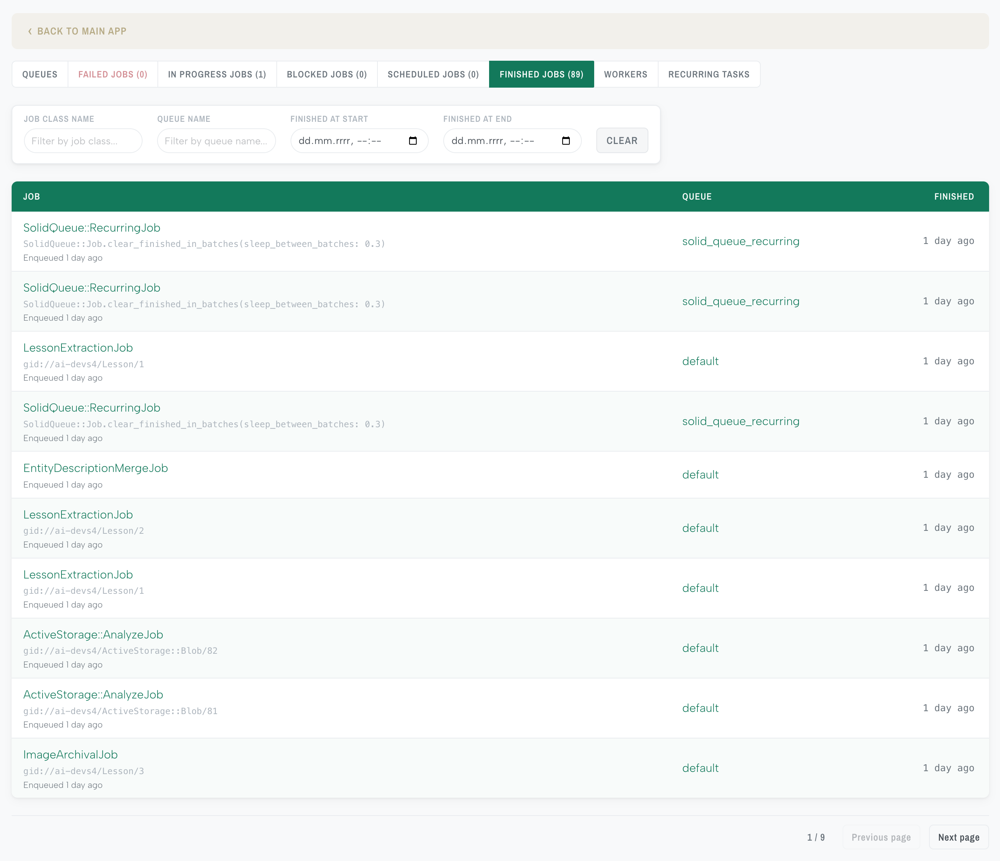
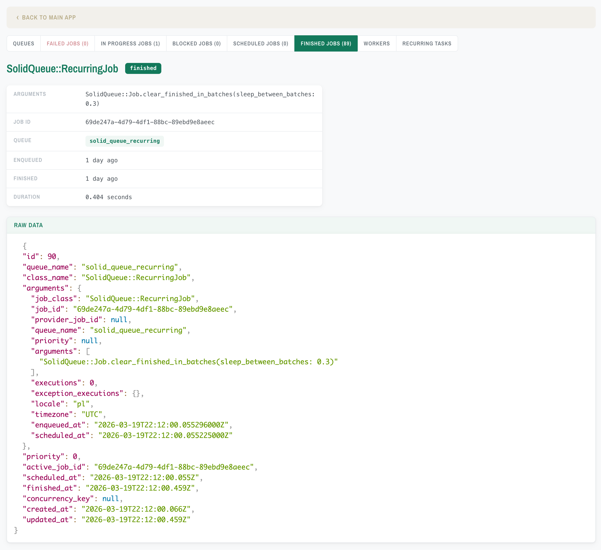
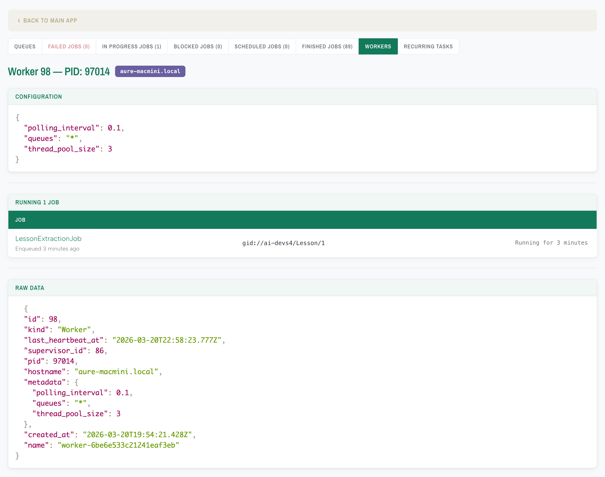

# MissionControl::Jobs::Theme

[](https://github.com/Velthorne/mission_control-jobs-theme/actions/workflows/main.yml)
[](https://badge.fury.io/rb/mission_control-jobs-theme)
[](https://opensource.org/licenses/MIT)

[MissionControl::Jobs](https://github.com/rails/mission_control-jobs) is a mature, well-maintained dashboard for managing background jobs in Rails — but its default UI is purely functional with little visual polish. Rather than building a custom tool from scratch or overriding MissionControl views (which would break or fall behind with every upstream release), this gem takes a CSS-only approach: it injects a custom stylesheet and optional syntax highlighting into MissionControl's HTML responses via Rack middleware. The result is a refreshed emerald-toned UI with refined typography (Archivo Narrow, Albert Sans) that stays fully functional even if upstream markup changes.

## Screenshots

### Jobs list


### Job details


### Worker overview


## Requirements

- Ruby **3.4+**
- Rails **8.1+**
- [mission_control-jobs](https://github.com/rails/mission_control-jobs) **>= 1.1**

> **Note:** The theme is likely compatible with lower versions of Ruby and Rails, but this hasn't been verified yet. Requirements will be relaxed once testing across additional versions is complete.

## Installation

Add to your Gemfile:

```ruby
gem "mission_control-jobs-theme"
```

Then run:

```bash
bundle install
```

The theme is active immediately — no configuration required.

## Configuration

To customize the defaults, generate an initializer:

```bash
bin/rails generate mission_control:jobs:theme:install
```

This creates `config/initializers/mission_control_jobs_theme.rb`:

```ruby
MissionControl::Jobs::Theme.configure do |config|
  # Mount path for MissionControl::Jobs::Engine (auto-discovered by default)
  # config.mount_path = "/jobs"

  # PrismJS syntax highlighting for JSON blocks on detail pages
  # config.syntax_highlighting = true
end
```

| Option                | Default                 | Description                                                                                                                                                                |
|-----------------------|-------------------------|----------------------------------------------------------------------------------------------------------------------------------------------------------------------------|
| `mount_path`          | `nil` (auto-discovered) | Override the path where `MissionControl::Jobs::Engine` is mounted. When `nil`, the gem walks `Rails.application.routes` to find it automatically, falling back to `/jobs`. |
| `syntax_highlighting` | `true`                  | Enable PrismJS JSON syntax highlighting on job detail pages. Set to `false` to inject only the CSS theme.                                                                  |

## Compatibility

- Designed for **MissionControl::Jobs 1.1+** which uses Bulma for its UI. The theme overrides Bulma variables and component styles.
- Works with **Propshaft** and **Sprockets** — the gem serves its own assets via `Rack::Static` and does not depend on the host app's asset pipeline.
- Turbo Drive and Turbo Stream responses pass through without modification.
- Tested with **Solid Queue**. Resque should mostly work since the theme is CSS-only, but some adapter-specific views may not be fully styled yet.

## Troubleshooting

### Theme not appearing

1. Verify the middleware is loaded — check that `MissionControl::Jobs::Theme::Middleware` appears in `bin/rails middleware` output.
2. Check mount path detection in the console:
   ```ruby
   MissionControl::Jobs::Theme::RouteDiscovery.discover(Rails.application.routes)
   ```
   If it returns an unexpected path, set `config.mount_path` explicitly in the initializer.
3. Ensure the engine is mounted in `config/routes.rb`:
   ```ruby
   mount MissionControl::Jobs::Engine, at: "/jobs"
   ```

### Stale assets after upgrade

Theme assets are served with immutable cache headers (1-year max-age). After upgrading the gem, browsers may serve stale files. Hard-refresh (`Ctrl+Shift+R`) or clear the browser cache.

## Contributing

Contributions of any kind are appreciated — whether it's a bug report, feature idea, or pull request. Feel free to open an [issue](https://github.com/Velthorne/mission_control-jobs-theme/issues) or submit a [PR](https://github.com/Velthorne/mission_control-jobs-theme/pulls).

```bash
bin/setup                 # Install dependencies
bundle exec rake spec     # Run the test suite
bin/console               # Interactive prompt
```

## License

The gem is available as open source under the terms of the [MIT License](https://opensource.org/licenses/MIT).
